U-M-S
==========================================

# Description
  U-M-S web application. Plug and Play

# Installation and use
### U-M-S is built using Laravel 5.2
```
$ git clone https://github.com/qlint/u-m-s-1.git
```
```
$ cd u-m-s-1
```
```
$ mv .env.example .env
```
**Change configuration in .env according your need and create Database**
```
$ composer install
```
```
$ php artisan migrate
```
```
$ php artisan db:seed
```

**Give write permission to storage and bootstrap/cache directory**

```
$ php artisan serve
```
**  http://localhost:8000 **
USER: admin
PASS: demo123


# Screenshot
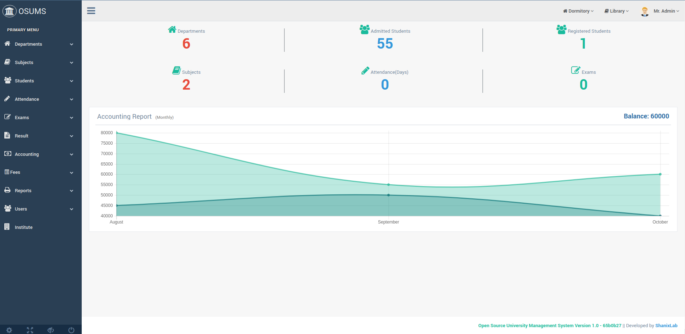
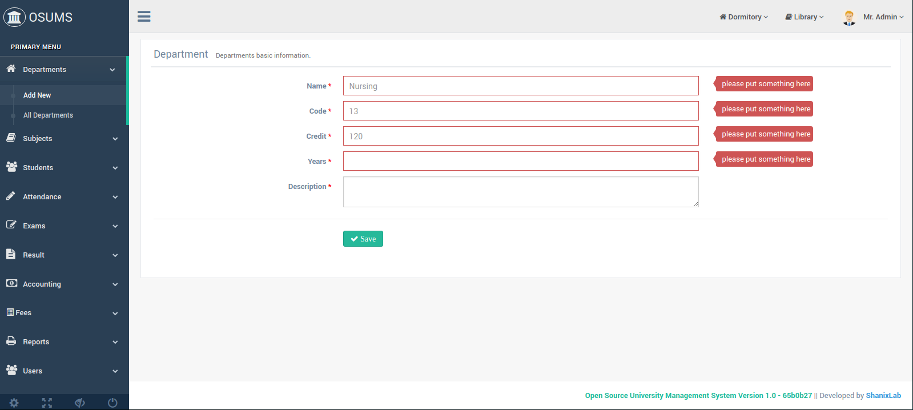
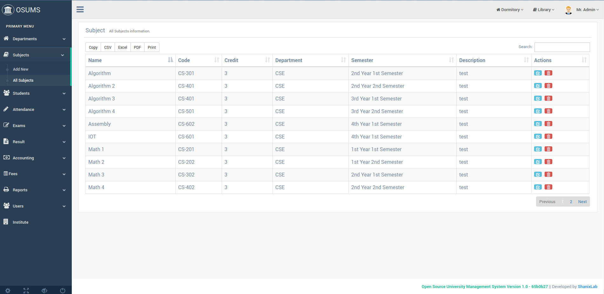
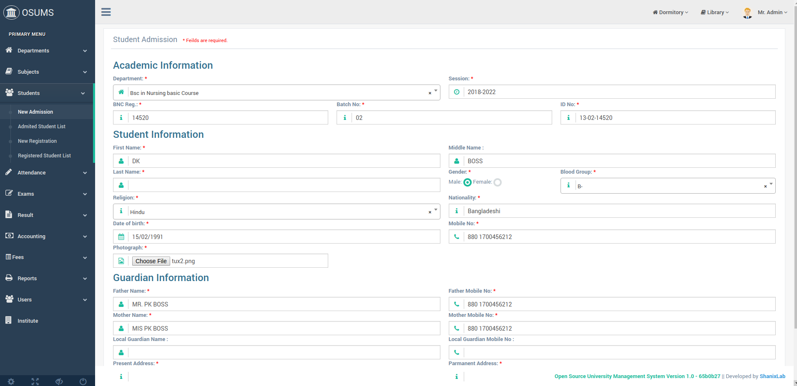
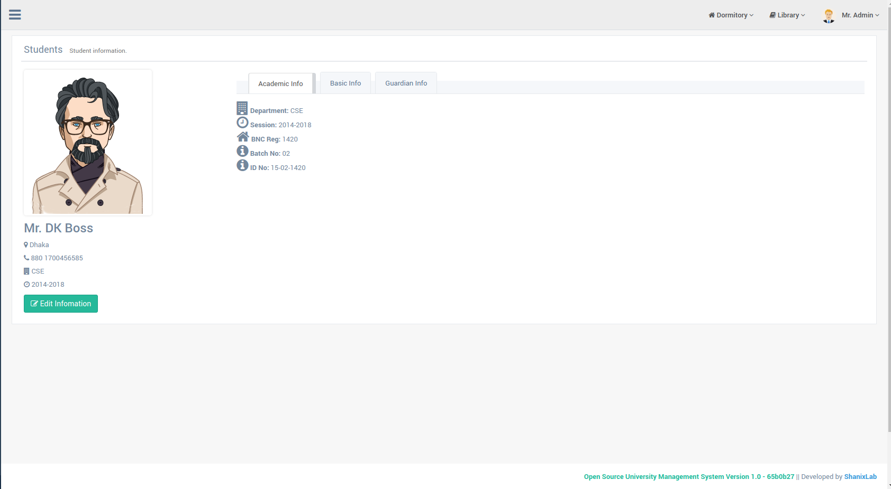
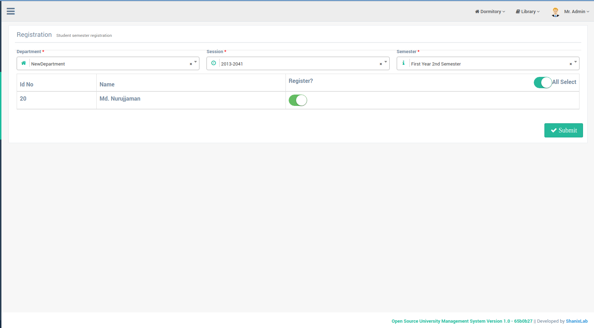
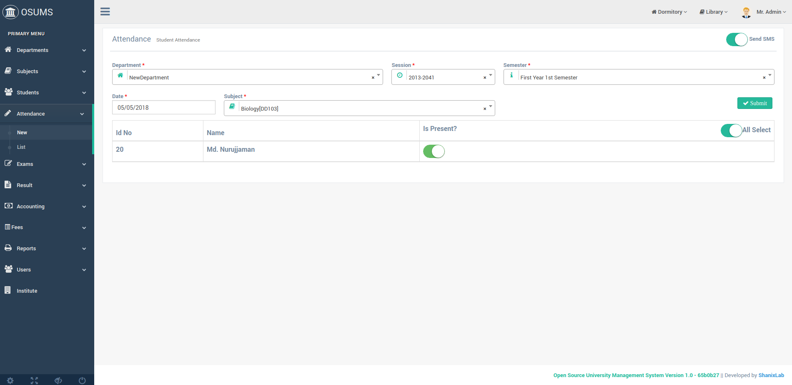
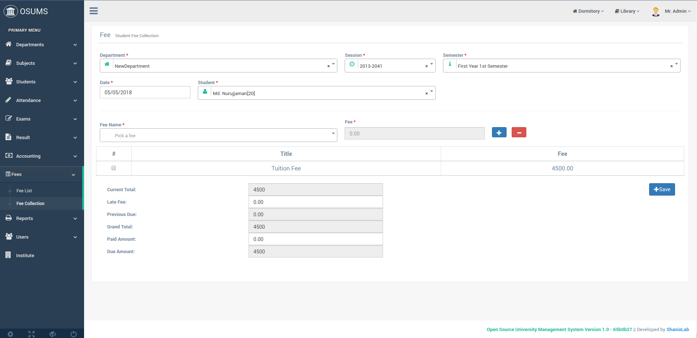
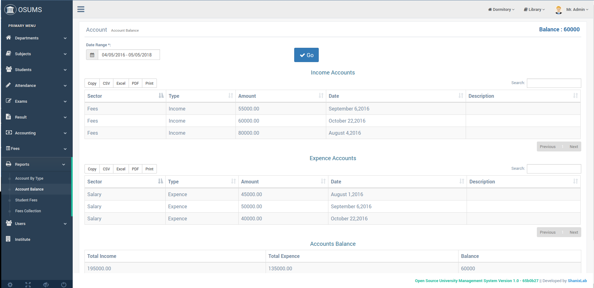
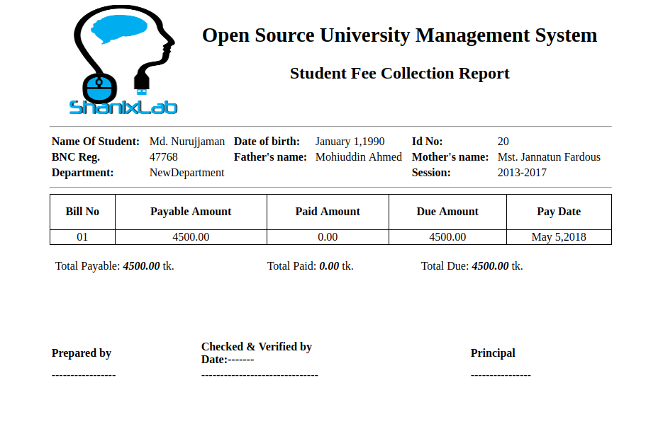
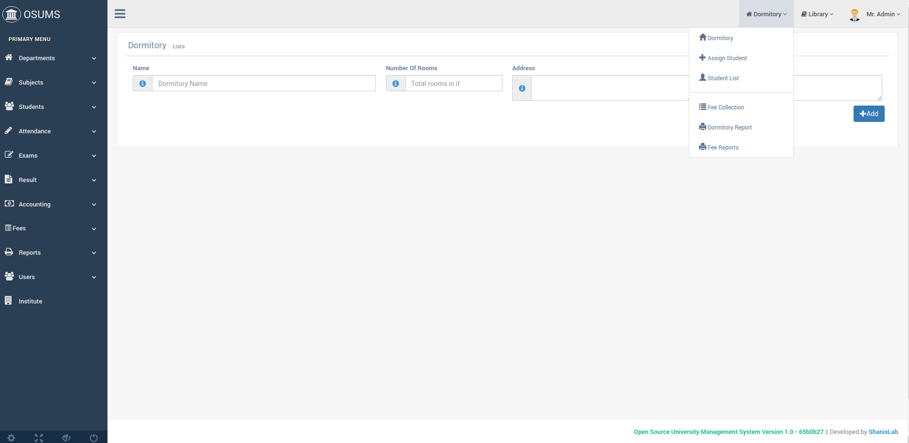
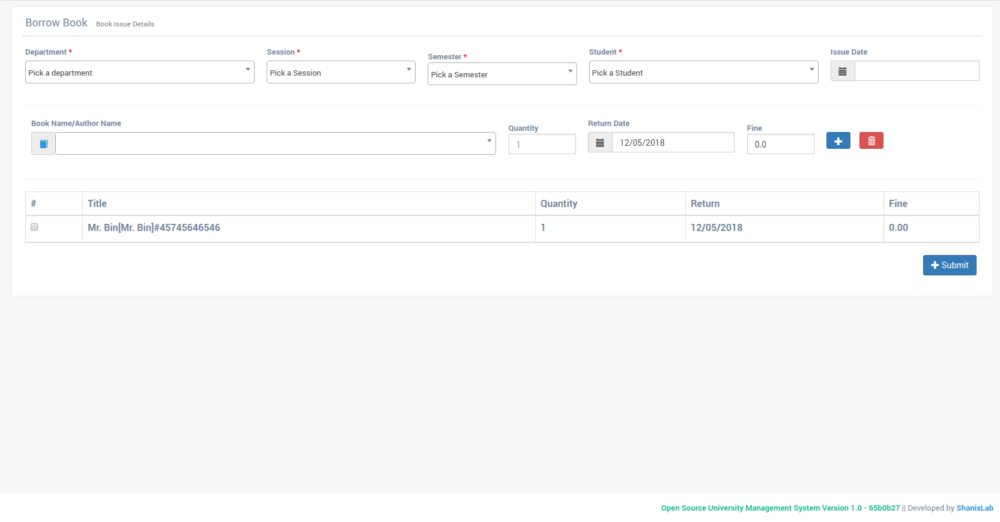
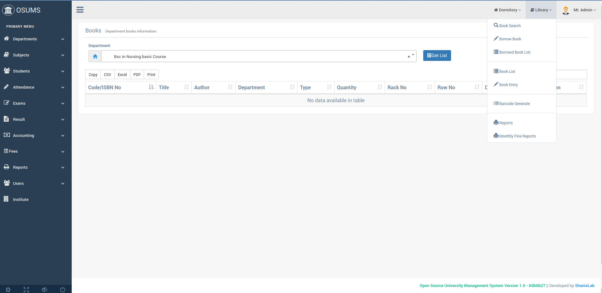
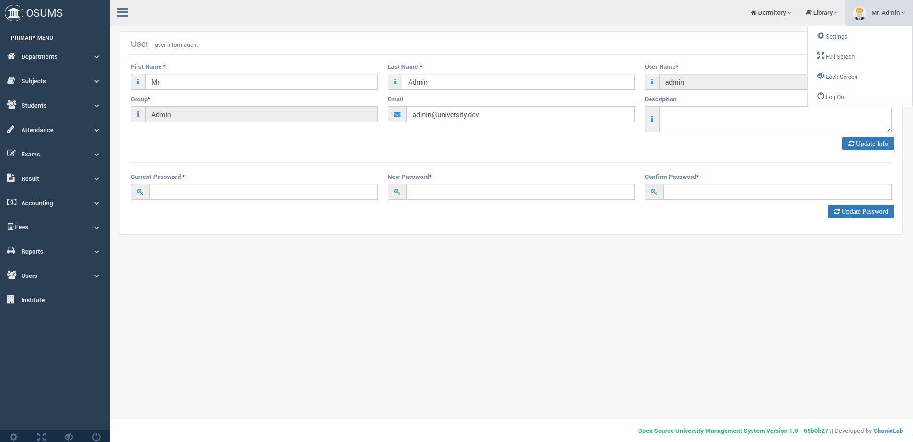
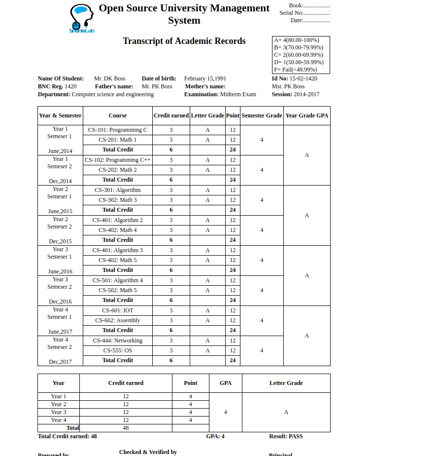


# License
U-M-S is open-sourced software licensed under the AGPL-3.0 license. Frameworks and libraries has it own licensed
